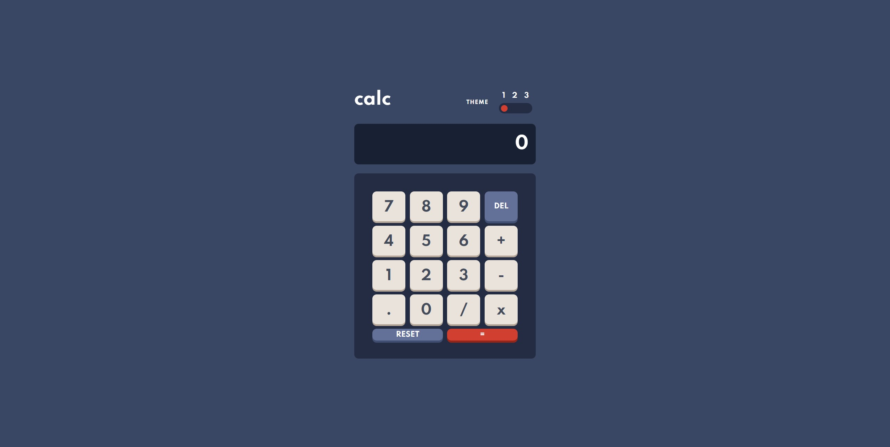

# Frontend Mentor - Calculator app solution

This is a solution to the [Calculator app challenge on Frontend Mentor](https://www.frontendmentor.io/challenges/calculator-app-9lteq5N29). Frontend Mentor challenges help you improve your coding skills by building realistic projects. 

## Table of contents

- [Overview](#overview)
  - [The challenge](#the-challenge)
  - [Screenshot](#screenshot)
  - [Links](#links)
- [My process](#my-process)
  - [Built with](#built-with)
  - [What I learned](#what-i-learned)
  - [Useful resources](#useful-resources)
- [Author](#author)

## Overview

### The challenge

Users should be able to:

- View the optimal layout for the site depending on their device's screen size
- Calculate your numbers
- Simple Calculator App With 3 Themes

### Screenshot

### Links

- Solution URL: https://github.com/arssssen/calculator-app-main
- Live Site URL: https://arssssen.github.io/calculator-app-main/

## My process

### Built with

- Started creating with Semantic HTML5 markup
- Added CSS styles
- Flexbox
- Use CSS Grid
- Added some advanced functionality using Javascript
- Deployed result on GitHub pages

### What I learned

This task helped me to develop our JS skills, and CSS variables.

### Useful resources

- Bootstrap v5.1 https://getbootstrap.com/docs/5.1/getting-started/introduction/
- W3School JS https://www.w3schools.com/js/default.asp
- MDN CSS Grid Layout https://developer.mozilla.org/ru/docs/Web/CSS/CSS_Grid_Layout/Basic_Concepts_of_Grid_Layout

## Authors

- GitHub - [Askhatuly Arsen](https://github.com/arssssen) & [Tulzhanov Nurali](https://github.com/nurks)
- Frontend Mentor - [@arssssen](https://www.frontendmentor.io/profile/arssssen) & [@nurks](https://www.frontendmentor.io/profile/nurks)
